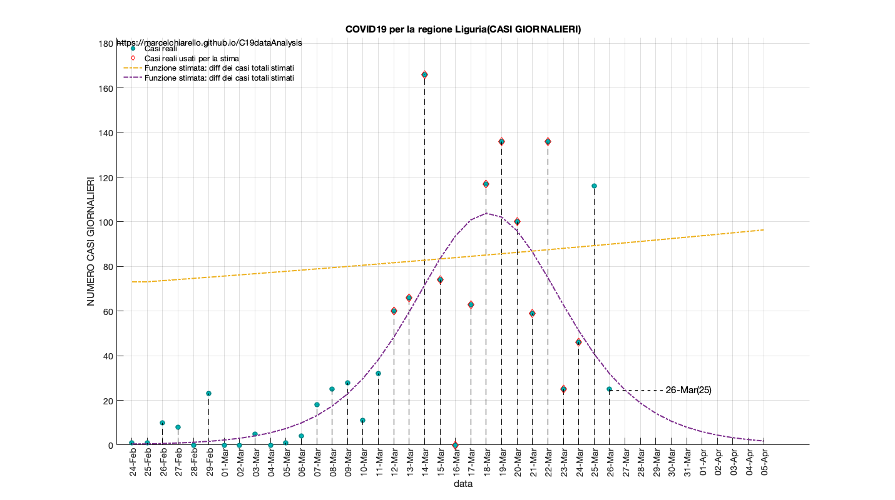
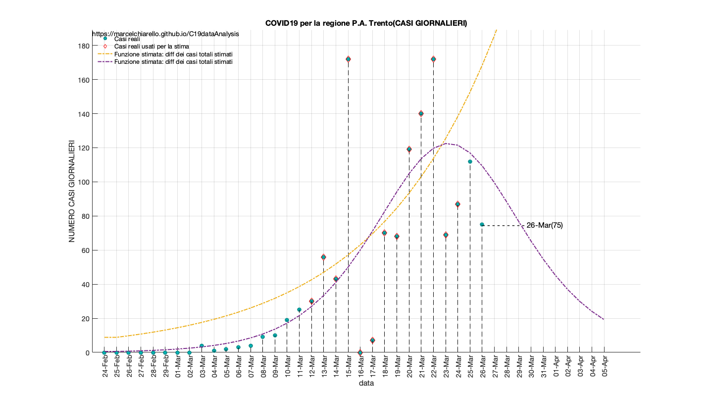

</head><body>
<h1></h1><!--introduction-->
<b>COVID19 Output analysis data updated to March 26, 2020</b>.

DRAFT

EDIT: - Removed the graphs for the individual provinces.       - English version, work in progress

Questo report &egrave; relativo all' elaborazione dei dati sulla diffusione del COVID-19 in Italia e nelle singole regioni/province. I dati sono forniti dalla protezione civile Italiana, consultabili al segunte link:

"https://github.com/pcm-dpc/COVID-19"

Tale report non &egrave; da intendersi come ufficiale o come definitivo nei termini delle previsioni incluse. I modelli non sono di tipo predittivo, bens&igrave; equazioni che descrivono i dati disponibili fino a questo momento. Il loro scopo &egrave; quello di valutare l andamento attuale, in modo da poter dedurre una eventuale accelerazione o decelerazione del contagio. In generale per ogni campione di dati viene selezionata una prima finestra temporale e la si utilizza per elaborare il modello (fitting) per poi confrontarlo con i giorni successivi.

I valori reali che non sono stati utilizzati per la stima del modello possono sia riferirsi a giorni passati, sia a giorni futuri, per una mera valutazione qualitativa.

-Per quanto concerne i dati regionali e provinciali, il fit &egrave; di tipo esponenziale/lineare. Una stima della funzione logistica/sigmoide viene effettuata per alcune regioni e/o province. Tale andamento viene stimato sulla base di una finestra temporale precedente con il fine di verificare che il punto/i punti futuri si collochino al di sopra o al di sotto della curva esponenziale, nell'assunzione che tale scostamento indichi un accelerazione o decelerazione del contagio.

-Per quanto concerne i dati nazionali, viene anche effettuata una stima qualitativa sulla base della funzione logistica/sigmoide, nell'assunzione che il giorno previsto di azzeramento dei contagi, sia conservativo verso il limite inferiore, ossia la minima data che occorre aspettare.

-Le stime vengono effettuate minimizzando la distanza quadratica media dalle curve ed i casi reali (Non Linear Least Square). Ogni modello non tiene conto dei punti iniziali secondo l'ipotesi di una sottostima dei contagi nei giorni che vanno da fine Febbraio/inizio Marzo.

Models and reports are under continuous review.

Source: https://github.com/marcelchiarello/C19dataAnalysis

Site: https://marcelchiarello.github.io/C19dataAnalysis/

Author: Marcello Chiarello

<a href="mailto:marcello.chiarello@outlook.com">marcello.chiarello@outlook.com</a>
<!--/introduction--><h2>Contents</h2>
<ul><li><a href="#2">GRAFICI ITALIA</a></li><li><a href="#3">GRAFICI PUGLIA</a></li><li><a href="#4">GRAFICI LOMBARDIA</a></li><li><a href="#5">GRAFICI VENETO</a></li><li><a href="#6">GRAFICI PIEMONTE</a></li><li><a href="#7">GRAFICI EMILIA ROMAGNA</a></li><li><a href="#8">GRAFICI CAMPANIA</a></li><li><a href="#9">GRAFICI SICILIA (Non presente)</a></li><li><a href="#10">GRAFICI ABRUZZO</a></li><li><a href="#11">GRAFICI BASILICATA</a></li><li><a href="#12">GRAFICI CALABRIA</a></li><li><a href="#13">GRAFICI CAMPANIA</a></li><li><a href="#14">GRAFICI FRIULI VENEZIA GIULIA</a></li><li><a href="#15">GRAFICI LAZIO</a></li><li><a href="#16">GRAFICI LIGURIA</a></li><li><a href="#17">GRAFICI MARCHE</a></li><li><a href="#18">GRAFICI MOLISE</a></li><li><a href="#19">GRAFICI P.A. Bolzano</a></li><li><a href="#20">GRAFICI P.A. Trento</a></li><li><a href="#21">GRAFICI SARDEGNA (Non presente)</a></li><li><a href="#22">GRAFICI TOSCANA</a></li><li><a href="#23">GRAFICI UMBRIA</a></li><li><a href="#24">GRAFICI VALLE D' AOSTA</a></li><li><a href="#25">DATI PUGLIA</a></li><li><a href="#26">DATI LOMBARDIA</a></li><li><a href="#27">DATI VENETO</a></li><li><a href="#28">DATI PIEMONTE</a></li><li><a href="#29">DATI EMILIA ROMAGNA</a></li><li><a href="#30">DATI CAMPANIA</a></li><li><a href="#31">DATI SICILIA</a></li><li><a href="#32">DATI ABRUZZO</a></li><li><a href="#33">DATI BASILICATA</a></li><li><a href="#34">DATI CALABRIA</a></li><li><a href="#35">DATI CAMPANIA</a></li><li><a href="#36">DATI VENEZIA GIULIA</a></li><li><a href="#37">DATI LAZIO</a></li><li><a href="#38">DATI LIGURIA</a></li><li><a href="#39">DATI MARCHE</a></li><li><a href="#40">DATI MOLISE</a></li><li><a href="#41">DATI P.A. Bolzano</a></li><li><a href="#42">DATI P.A. Trento</a></li><li><a href="#43">DATI SARDEGNA</a></li><li><a href="#44">DATI TOSCANA</a></li><li><a href="#45">DATI UMBRIA</a></li><li><a href="#46">DATI VALLE D' AOSTA</a></li></ul>
<h2 id="2">GRAFICI ITALIA</h2><pre class="codeoutput">RUN DATA: 26-Mar-2020
Total cases summary

TABLE =

  1&times;4 table

    Contagiati    Deceduti    Tamponi    Dimessi
    __________    ________    _______    _______

      80539         8165      361060      10361 

 
Tabella riassuntiva casi giornalieri

TABLE =

  1&times;4 table

    Contagiati    Deceduti    Tamponi    Dimessi
    __________    ________    _______    _______

       6153         662        36615       999  

***********************
Stima e previsioni dati nazionali
 
Intervallo dati utilizzati per la stima del modello: 10-Mar :: 24-Mar
</pre>    <h2 id="3">GRAFICI PUGLIA</h2><pre class="codeoutput">RUN DATA: 26-Mar-2020
***********************
Stima e previsione dati regionali
 
Intervallo dati utilizzati per la stima del modello: 12-Mar :: 24-Mar
 
</pre>  <h2 id="4">GRAFICI LOMBARDIA</h2><pre class="codeoutput">RUN DATA: 26-Mar-2020
***********************
Stima e previsione dati regionali
 
Intervallo dati utilizzati per la stima del modello: 12-Mar :: 24-Mar
 
</pre>  <h2 id="5">GRAFICI VENETO</h2><pre class="codeoutput">RUN DATA: 26-Mar-2020
***********************
Stima e previsione dati regionali
 
Intervallo dati utilizzati per la stima del modello: 12-Mar :: 24-Mar
 
</pre>  <h2 id="6">GRAFICI PIEMONTE</h2><pre class="codeoutput">RUN DATA: 26-Mar-2020
***********************
Stima e previsione dati regionali
 
Intervallo dati utilizzati per la stima del modello: 12-Mar :: 24-Mar
 
</pre>  <h2 id="7">GRAFICI EMILIA ROMAGNA</h2><pre class="codeoutput">RUN DATA: 26-Mar-2020
***********************
Stima e previsione dati regionali
 
Intervallo dati utilizzati per la stima del modello: 12-Mar :: 24-Mar
 
</pre>  <h2 id="8">GRAFICI CAMPANIA</h2><pre class="codeoutput">RUN DATA: 26-Mar-2020
***********************
Stima e previsione dati regionali
 
Intervallo dati utilizzati per la stima del modello: 12-Mar :: 24-Mar
 
</pre>  <h2 id="9">GRAFICI SICILIA (Non presente)</h2><pre class="codeoutput">RUN DATA: 26-Mar-2020
***********************
Stima e previsione dati regionali
 
Intervallo dati utilizzati per la stima del modello: 12-Mar :: 24-Mar
 
</pre>  <h2 id="10">GRAFICI ABRUZZO</h2><pre class="codeoutput">RUN DATA: 26-Mar-2020
***********************
Stima e previsione dati regionali
 
Intervallo dati utilizzati per la stima del modello: 12-Mar :: 24-Mar
 
</pre>  <h2 id="11">GRAFICI BASILICATA</h2><pre class="codeoutput">RUN DATA: 26-Mar-2020
***********************
Stima e previsione dati regionali
 
Intervallo dati utilizzati per la stima del modello: 12-Mar :: 24-Mar
 
</pre>  <h2 id="12">GRAFICI CALABRIA</h2><pre class="codeoutput">RUN DATA: 26-Mar-2020
***********************
Stima e previsione dati regionali
 
Intervallo dati utilizzati per la stima del modello: 12-Mar :: 24-Mar
 
</pre>  <h2 id="13">GRAFICI CAMPANIA</h2><pre class="codeoutput">RUN DATA: 26-Mar-2020
***********************
Stima e previsione dati regionali
 
Intervallo dati utilizzati per la stima del modello: 12-Mar :: 24-Mar
 
</pre>  <h2 id="14">GRAFICI FRIULI VENEZIA GIULIA</h2><pre class="codeoutput">RUN DATA: 26-Mar-2020
***********************
Stima e previsione dati regionali
 
Intervallo dati utilizzati per la stima del modello: 12-Mar :: 24-Mar
 
</pre>  <h2 id="15">GRAFICI LAZIO</h2><pre class="codeoutput">RUN DATA: 26-Mar-2020
***********************
Stima e previsione dati regionali
 
Intervallo dati utilizzati per la stima del modello: 12-Mar :: 24-Mar
 
</pre>  <h2 id="16">GRAFICI LIGURIA</h2><pre class="codeoutput">RUN DATA: 26-Mar-2020
***********************
Stima e previsione dati regionali
 
Intervallo dati utilizzati per la stima del modello: 12-Mar :: 24-Mar
 
</pre>  <h2 id="17">GRAFICI MARCHE</h2><pre class="codeoutput">RUN DATA: 26-Mar-2020
***********************
Stima e previsione dati regionali
 
Intervallo dati utilizzati per la stima del modello: 12-Mar :: 24-Mar
 
</pre>  <h2 id="18">GRAFICI MOLISE</h2><pre class="codeoutput">RUN DATA: 26-Mar-2020
***********************
Stima e previsione dati regionali
 
Intervallo dati utilizzati per la stima del modello: 12-Mar :: 24-Mar
 
</pre>  <h2 id="19">GRAFICI P.A. Bolzano</h2><pre class="codeoutput">RUN DATA: 26-Mar-2020
***********************
Stima e previsione dati regionali
 
Intervallo dati utilizzati per la stima del modello: 12-Mar :: 24-Mar
 
</pre>  <h2 id="20">GRAFICI P.A. Trento</h2><pre class="codeoutput">RUN DATA: 26-Mar-2020
***********************
Stima e previsione dati regionali
 
Intervallo dati utilizzati per la stima del modello: 12-Mar :: 24-Mar
 
</pre>  <h2 id="21">GRAFICI SARDEGNA (Non presente)</h2><pre class="codeoutput">RUN DATA: 26-Mar-2020
***********************
Stima e previsione dati regionali
 
Intervallo dati utilizzati per la stima del modello: 12-Mar :: 24-Mar
 
</pre>  <h2 id="22">GRAFICI TOSCANA</h2><pre class="codeoutput">RUN DATA: 26-Mar-2020
***********************
Stima e previsione dati regionali
 
Intervallo dati utilizzati per la stima del modello: 12-Mar :: 24-Mar
 
</pre>  <h2 id="23">GRAFICI UMBRIA</h2><pre class="codeoutput">RUN DATA: 26-Mar-2020
***********************
Stima e previsione dati regionali
 
Intervallo dati utilizzati per la stima del modello: 12-Mar :: 24-Mar
 
</pre>  <h2 id="24">GRAFICI VALLE D' AOSTA</h2><pre class="codeoutput">RUN DATA: 26-Mar-2020
***********************
Stima e previsione dati regionali
 
Intervallo dati utilizzati per la stima del modello: 12-Mar :: 24-Mar
 
</pre>  <h2 id="25">DATI PUGLIA</h2><pre class="codeoutput">RUN DATA: 26-Mar-2020
Tabella casi giornalieri per la regione Puglia
 

TABLE =

  6&times;2 table

           province            casiGiornalieri
    _______________________    _______________

    "Bari"                           51       
    "Barletta-Andria-Trani"          20       
    "Brindisi"                        6       
    "Foggia"                         28       
    "Lecce"                          13       
    "Taranto"                        18       

    "Casi giornalieri totali:"    "136"

    "Casi regione totali:"    "1150"

fonte: elaborazione dei dati della protezione civile
***********************
Stima e previsione dati regionali
 
Intervallo dati utilizzati per la stima del modello: 12-Mar :: 24-Mar
 
</pre><h2 id="26">DATI LOMBARDIA</h2><pre class="codeoutput">RUN DATA: 26-Mar-2020
Tabella casi giornalieri per la regione Lombardia
 

TABLE =

  12&times;2 table

           province            casiGiornalieri
    _______________________    _______________

    "Bergamo"                        386      
    "Brescia"                        334      
    "Como"                            56      
    "Cremona"                        214      
    "Lecco"                           83      
    "Lodi"                            84      
    "Mantova"                         74      
    "Milano"                         848      
    "Monza e della Brianza"          163      
    "Pavia"                          107      
    "Sondrio"                         41      
    "Varese"                          34      

    "Casi giornalieri totali:"    "2424"

    "Casi regione totali:"    "34082"

fonte: elaborazione dei dati della protezione civile
***********************
Stima e previsione dati regionali
 
Intervallo dati utilizzati per la stima del modello: 12-Mar :: 24-Mar
 
</pre><h2 id="27">DATI VENETO</h2><pre class="codeoutput">RUN DATA: 26-Mar-2020
Tabella casi giornalieri per la regione Veneto
 

TABLE =

  7&times;2 table

    province     casiGiornalieri
    _________    _______________

    "Belluno"           15      
    "Padova"           141      
    "Rovigo"            23      
    "Treviso"           77      
    "Venezia"           46      
    "Verona"            98      
    "Vicenza"           75      

    "Casi giornalieri totali:"    "475"

    "Casi regione totali:"    "6675"

fonte: elaborazione dei dati della protezione civile
***********************
Stima e previsione dati regionali
 
Intervallo dati utilizzati per la stima del modello: 12-Mar :: 24-Mar
 
</pre><h2 id="28">DATI PIEMONTE</h2><pre class="codeoutput">RUN DATA: 26-Mar-2020
Tabella casi giornalieri per la regione Piemonte
 

TABLE =

  8&times;2 table

           province           casiGiornalieri
    ______________________    _______________

    "Alessandria"                    34      
    "Asti"                           21      
    "Biella"                          9      
    "Cuneo"                          46      
    "Novara"                         60      
    "Torino"                        295      
    "Verbano-Cusio-Ossola"            8      
    "Vercelli"                       28      

    "Casi giornalieri totali:"    "501"

    "Casi regione totali:"    "6361"

fonte: elaborazione dei dati della protezione civile
***********************
Stima e previsione dati regionali
 
Intervallo dati utilizzati per la stima del modello: 12-Mar :: 24-Mar
 
</pre><h2 id="29">DATI EMILIA ROMAGNA</h2><pre class="codeoutput">RUN DATA: 26-Mar-2020
Tabella casi giornalieri per la regione Emilia Romagna
 

TABLE =

  9&times;2 table

          province          casiGiornalieri
    ____________________    _______________

    "Bologna"                     146      
    "Ferrara"                       8      
    "Forl&Atilde;&not;-Cesena"                59      
    "Modena"                      143      
    "Parma"                        86      
    "Piacenza"                     91      
    "Ravenna"                      64      
    "Reggio nell'Emilia"          112      
    "Rimini"                       53      

    "Casi giornalieri totali:"    "762"

    "Casi regione totali:"    "10816"

fonte: elaborazione dei dati della protezione civile
***********************
Stima e previsione dati regionali
 
Intervallo dati utilizzati per la stima del modello: 12-Mar :: 24-Mar
 
</pre><h2 id="30">DATI CAMPANIA</h2><pre class="codeoutput">RUN DATA: 26-Mar-2020
Tabella casi giornalieri per la regione Campania
 

TABLE =

  5&times;2 table

     province      casiGiornalieri
    ___________    _______________

    "Avellino"            8       
    "Benevento"           0       
    "Caserta"            12       
    "Napoli"             39       
    "Salerno"            24       

    "Casi giornalieri totali:"    "83"

    "Casi regione totali:"    "1280"

fonte: elaborazione dei dati della protezione civile
***********************
Stima e previsione dati regionali
 
Intervallo dati utilizzati per la stima del modello: 12-Mar :: 24-Mar
 
</pre><h2 id="31">DATI SICILIA</h2><pre class="codeoutput">RUN DATA: 26-Mar-2020
Tabella casi giornalieri per la regione Sicilia
 

TABLE =

  9&times;2 table

       province        casiGiornalieri
    _______________    _______________

    "Agrigento"               5       
    "Caltanissetta"           5       
    "Catania"                38       
    "Enna"                   43       
    "Messina"                47       
    "Palermo"                12       
    "Ragusa"                  6       
    "Siracusa"               13       
    "Trapani"                 1       

    "Casi giornalieri totali:"    "170"

    "Casi regione totali:"    "1164"

fonte: elaborazione dei dati della protezione civile
***********************
Stima e previsione dati regionali
 
Intervallo dati utilizzati per la stima del modello: 12-Mar :: 24-Mar
 
</pre><h2 id="32">DATI ABRUZZO</h2><pre class="codeoutput">RUN DATA: 26-Mar-2020
Tabella casi giornalieri per la regione Abruzzo
 

TABLE =

  4&times;2 table

     province     casiGiornalieri
    __________    _______________

    "Chieti"            29       
    "L'Aquila"           4       
    "Pescara"           33       
    "Teramo"            67       

    "Casi giornalieri totali:"    "133"

    "Casi regione totali:"    "946"

fonte: elaborazione dei dati della protezione civile
***********************
Stima e previsione dati regionali
 
Intervallo dati utilizzati per la stima del modello: 12-Mar :: 24-Mar
 
</pre><h2 id="33">DATI BASILICATA</h2><pre class="codeoutput">RUN DATA: 26-Mar-2020
Tabella casi giornalieri per la regione Basilicata
 

TABLE =

  2&times;2 table

    province     casiGiornalieri
    _________    _______________

    "Matera"           12       
    "Potenza"          16       

    "Casi giornalieri totali:"    "28"

    "Casi regione totali:"    "134"

fonte: elaborazione dei dati della protezione civile
***********************
Stima e previsione dati regionali
 
Intervallo dati utilizzati per la stima del modello: 12-Mar :: 24-Mar
 
</pre><h2 id="34">DATI CALABRIA</h2><pre class="codeoutput">RUN DATA: 26-Mar-2020
Tabella casi giornalieri per la regione Calabria
 

TABLE =

  5&times;2 table

          province          casiGiornalieri
    ____________________    _______________

    "Catanzaro"                    2       
    "Cosenza"                      8       
    "Crotone"                      9       
    "Reggio di Calabria"          18       
    "Vibo Valentia"                5       

    "Casi giornalieri totali:"    "42"

    "Casi regione totali:"    "391"

fonte: elaborazione dei dati della protezione civile
***********************
Stima e previsione dati regionali
 
Intervallo dati utilizzati per la stima del modello: 12-Mar :: 24-Mar
 
</pre><h2 id="35">DATI CAMPANIA</h2><pre class="codeoutput">RUN DATA: 26-Mar-2020
Tabella casi giornalieri per la regione Campania
 

TABLE =

  5&times;2 table

     province      casiGiornalieri
    ___________    _______________

    "Avellino"            8       
    "Benevento"           0       
    "Caserta"            12       
    "Napoli"             39       
    "Salerno"            24       

    "Casi giornalieri totali:"    "83"

    "Casi regione totali:"    "1280"

fonte: elaborazione dei dati della protezione civile
***********************
Stima e previsione dati regionali
 
Intervallo dati utilizzati per la stima del modello: 12-Mar :: 24-Mar
 
</pre><h2 id="36">DATI VENEZIA GIULIA</h2><pre class="codeoutput">RUN DATA: 26-Mar-2020
Tabella casi giornalieri per la regione Friuli Venezia Giulia
 

TABLE =

  4&times;2 table

     province      casiGiornalieri
    ___________    _______________

    "Gorizia"            10       
    "Pordenone"          18       
    "Trieste"            30       
    "Udine"              29       

    "Casi giornalieri totali:"    "87"

    "Casi regione totali:"    "1215"

fonte: elaborazione dei dati della protezione civile
***********************
Stima e previsione dati regionali
 
Intervallo dati utilizzati per la stima del modello: 12-Mar :: 24-Mar
 
</pre><h2 id="37">DATI LAZIO</h2><pre class="codeoutput">RUN DATA: 26-Mar-2020
Tabella casi giornalieri per la regione Lazio
 

TABLE =

  5&times;2 table

     province      casiGiornalieri
    ___________    _______________

    "Frosinone"           50      
    "Latina"               8      
    "Rieti"                2      
    "Roma"               139      
    "Viterbo"              0      

    "Casi giornalieri totali:"    "199"

    "Casi regione totali:"    "2092"

fonte: elaborazione dei dati della protezione civile
***********************
Stima e previsione dati regionali
 
Intervallo dati utilizzati per la stima del modello: 12-Mar :: 24-Mar
 
</pre><h2 id="38">DATI LIGURIA</h2><pre class="codeoutput">RUN DATA: 26-Mar-2020
Tabella casi giornalieri per la regione Liguria
 

TABLE =

  4&times;2 table

     province      casiGiornalieri
    ___________    _______________

    "Genova"             -20      
    "Imperia"             34      
    "La Spezia"           12      
    "Savona"              -1      

    "Casi giornalieri totali:"    "25"

    "Casi regione totali:"    "1331"

fonte: elaborazione dei dati della protezione civile
***********************
Stima e previsione dati regionali
 
Intervallo dati utilizzati per la stima del modello: 12-Mar :: 24-Mar
 
</pre><h2 id="39">DATI MARCHE</h2><pre class="codeoutput">RUN DATA: 26-Mar-2020
Tabella casi giornalieri per la regione Marche
 

TABLE =

  5&times;2 table

        province         casiGiornalieri
    _________________    _______________

    "Ancona"                   49       
    "Ascoli Piceno"            31       
    "Fermo"                    44       
    "Macerata"                 10       
    "Pesaro e Urbino"          42       

    "Casi giornalieri totali:"    "176"

    "Casi regione totali:"    "3063"

fonte: elaborazione dei dati della protezione civile
***********************
Stima e previsione dati regionali
 
Intervallo dati utilizzati per la stima del modello: 12-Mar :: 24-Mar
 
</pre><h2 id="40">DATI MOLISE</h2><pre class="codeoutput">RUN DATA: 26-Mar-2020
Tabella casi giornalieri per la regione Molise
 

TABLE =

  2&times;2 table

      province      casiGiornalieri
    ____________    _______________

    "Campobasso"          25       
    "Isernia"              5       

    "Casi giornalieri totali:"    "30"

    "Casi regione totali:"    "94"

fonte: elaborazione dei dati della protezione civile
***********************
Stima e previsione dati regionali
 
Intervallo dati utilizzati per la stima del modello: 12-Mar :: 24-Mar
 
</pre><h2 id="41">DATI P.A. Bolzano</h2><pre class="codeoutput">RUN DATA: 26-Mar-2020
Tabella casi giornalieri per la regione P.A. Bolzano
 

TABLE =

  1&times;2 table

    province     casiGiornalieri
    _________    _______________

    "Bolzano"          48       

    "Casi giornalieri totali:"    "48"

    "Casi regione totali:"    "906"

fonte: elaborazione dei dati della protezione civile
***********************
Stima e previsione dati regionali
 
Intervallo dati utilizzati per la stima del modello: 12-Mar :: 24-Mar
 
</pre><h2 id="42">DATI P.A. Trento</h2><pre class="codeoutput">RUN DATA: 26-Mar-2020
Tabella casi giornalieri per la regione P.A. Trento
 

TABLE =

  1&times;2 table

    province    casiGiornalieri
    ________    _______________

    "Trento"          75       

    "Casi giornalieri totali:"    "75"

    "Casi regione totali:"    "1297"

fonte: elaborazione dei dati della protezione civile
***********************
Stima e previsione dati regionali
 
Intervallo dati utilizzati per la stima del modello: 12-Mar :: 24-Mar
 
</pre><h2 id="43">DATI SARDEGNA</h2><pre class="codeoutput">RUN DATA: 26-Mar-2020
Tabella casi giornalieri per la regione Sardegna
 

TABLE =

  5&times;2 table

       province       casiGiornalieri
    ______________    _______________

    "Cagliari"               9       
    "Nuoro"                 26       
    "Oristano"               0       
    "Sassari"               13       
    "Sud Sardegna"           4       

    "Casi giornalieri totali:"    "52"

    "Casi regione totali:"    "494"

fonte: elaborazione dei dati della protezione civile
***********************
Stima e previsione dati regionali
 
Intervallo dati utilizzati per la stima del modello: 12-Mar :: 24-Mar
 
</pre><h2 id="44">DATI TOSCANA</h2><pre class="codeoutput">RUN DATA: 26-Mar-2020
Tabella casi giornalieri per la regione Toscana
 

TABLE =

  10&times;2 table

       province        casiGiornalieri
    _______________    _______________

    "Arezzo"                 20       
    "Firenze"                55       
    "Grosseto"               27       
    "Livorno"                25       
    "Lucca"                  45       
    "Massa Carrara"           4       
    "Pisa"                   33       
    "Pistoia"                10       
    "Prato"                  11       
    "Siena"                  23       

    "Casi giornalieri totali:"    "253"

    "Casi regione totali:"    "3225"

fonte: elaborazione dei dati della protezione civile
***********************
Stima e previsione dati regionali
 
Intervallo dati utilizzati per la stima del modello: 12-Mar :: 24-Mar
 
</pre><h2 id="45">DATI UMBRIA</h2><pre class="codeoutput">RUN DATA: 26-Mar-2020
Tabella casi giornalieri per la regione Umbria
 

TABLE =

  2&times;2 table

    province     casiGiornalieri
    _________    _______________

    "Perugia"          77       
    "Terni"            15       

    "Casi giornalieri totali:"    "92"

    "Casi regione totali:"    "778"

fonte: elaborazione dei dati della protezione civile
***********************
Stima e previsione dati regionali
 
Intervallo dati utilizzati per la stima del modello: 12-Mar :: 24-Mar
 
</pre><h2 id="46">DATI VALLE D' AOSTA</h2><pre class="codeoutput">RUN DATA: 26-Mar-2020
    "Tabella casi giornalieri per la regione "    "Valle d'Aosta"

 

TABLE =

  1&times;2 table

    province    casiGiornalieri
    ________    _______________

    "Aosta"            7       

    "Casi giornalieri totali:"    "7"

    "Casi regione totali:"    "408"

fonte: elaborazione dei dati della protezione civile
***********************
Stima e previsione dati regionali
 
Intervallo dati utilizzati per la stima del modello: 12-Mar :: 24-Mar
 
</pre>
 <a href="https://www.mathworks.com/products/matlab/">Published with MATLAB&reg; R2018a</a> 

<!--
##### SOURCE BEGIN #####
%%
% *COVID19 Output analysis data updated to March 26, 2020*.
%
% DRAFT
%
% EDIT: - Removed the graphs for the individual provinces.
%       - English version, work in progress
%       
% Questo report è relativo all' elaborazione dei dati sulla diffusione del COVID-19 in Italia e nelle singole regioni/province. 
% I dati sono forniti dalla protezione civile Italiana, consultabili al segunte link:
%
% "https://github.com/pcm-dpc/COVID-19"
%
% Tale report non è da intendersi come ufficiale o come definitivo nei termini delle previsioni incluse. I modelli non sono 
% di tipo predittivo, bensì equazioni che descrivono i dati disponibili fino a questo momento. Il loro scopo è quello di valutare l andamento attuale,
% in modo da poter dedurre una eventuale accelerazione o decelerazione del contagio. In generale per ogni campione di dati
% viene selezionata una prima finestra temporale e la si utilizza per elaborare il modello (fitting) per poi confrontarlo con i giorni successivi. 
%
% I valori reali che non sono stati utilizzati per la stima del modello possono sia riferirsi a giorni passati,
% sia a giorni futuri, per una mera valutazione qualitativa. 
%
% -Per quanto concerne i dati regionali e provinciali, il fit è di tipo
% esponenziale/lineare. Una stima della funzione logistica/sigmoide viene
% effettuata per alcune regioni e/o province. Tale andamento viene stimato sulla base di una finestra
% temporale precedente con il fine di verificare che il punto/i punti futuri si
% collochino al di sopra o al di sotto della curva esponenziale, nell'assunzione che
% tale scostamento indichi un accelerazione o decelerazione del contagio.
%
% -Per quanto concerne i dati nazionali, viene anche effettuata una stima
% qualitativa sulla base della funzione logistica/sigmoide, nell'assunzione
% che il giorno previsto di azzeramento dei contagi, sia conservativo verso
% il limite inferiore, ossia la minima data che occorre aspettare.
%
% -Le stime vengono effettuate minimizzando la distanza quadratica media
% dalle curve ed i casi reali (Non Linear Least Square).
% Ogni modello non tiene conto dei punti iniziali secondo l'ipotesi di una
% sottostima dei contagi nei giorni che vanno da fine Febbraio/inizio
% Marzo.
%
% Models and reports are under continuous review.
%
% Source: https://github.com/marcelchiarello/C19dataAnalysis
%
% Site: https://marcelchiarello.github.io/C19dataAnalysis/
%
% Author: Marcello Chiarello
%
% marcello.chiarello@outlook.com
%%
%Read data
clear 
close all
clc
format long

evalc('NATIONALDATA = readItalia');
evalc('ALLDATA = readCovidData');

setGlobal(0); % 0 Italiano, 1 Inglese

%% GRAFICI ITALIA
RUN_ITALIA(NATIONALDATA,1);
PLOTITA;

%% GRAFICI PUGLIA
RUN_REGIONE(ALLDATA,'Puglia',1,1);

%% GRAFICI LOMBARDIA
RUN_REGIONE(ALLDATA,'Lombardia',1,1);

%% GRAFICI VENETO
RUN_REGIONE(ALLDATA,'Veneto',1,1);

%% GRAFICI PIEMONTE
RUN_REGIONE(ALLDATA,'Piemonte',1,1);

%% GRAFICI EMILIA ROMAGNA
RUN_REGIONE(ALLDATA,'Emilia Romagna',1,1);

%% GRAFICI CAMPANIA
RUN_REGIONE(ALLDATA,'Campania',1,1);

%% GRAFICI SICILIA (Non presente)
RUN_REGIONE(ALLDATA,'Sicilia',1,1);

%% GRAFICI ABRUZZO
RUN_REGIONE(ALLDATA,'Abruzzo',1,1);

%% GRAFICI BASILICATA
RUN_REGIONE(ALLDATA,'Basilicata',1,1);

%% GRAFICI CALABRIA
RUN_REGIONE(ALLDATA,'Calabria',1,1);

%% GRAFICI CAMPANIA
RUN_REGIONE(ALLDATA,'Campania',1,1);

%% GRAFICI FRIULI VENEZIA GIULIA
RUN_REGIONE(ALLDATA,'Friuli Venezia Giulia',1,1);

%% GRAFICI LAZIO
RUN_REGIONE(ALLDATA,'Lazio',1,1);

%% GRAFICI LIGURIA
RUN_REGIONE(ALLDATA,'Liguria',1,1);

%% GRAFICI MARCHE
RUN_REGIONE(ALLDATA,'Marche',1,1);

%% GRAFICI MOLISE
RUN_REGIONE(ALLDATA,'Molise',1);

%% GRAFICI P.A. Bolzano
RUN_REGIONE(ALLDATA,'P.A. Bolzano',1,1);

%% GRAFICI P.A. Trento
RUN_REGIONE(ALLDATA,'P.A. Trento',1,1);

%% GRAFICI SARDEGNA (Non presente)
RUN_REGIONE(ALLDATA,'Sardegna',1);

%% GRAFICI TOSCANA
RUN_REGIONE(ALLDATA,'Toscana',1,1);

%% GRAFICI UMBRIA
RUN_REGIONE(ALLDATA,'Umbria',1,1);

%% GRAFICI VALLE D' AOSTA
RUN_REGIONE(ALLDATA,"Valle d'Aosta",1,1);

%%%%%%%%%%%%%%%%%%%%%%%%%%%%%%%%%%%%%%%%%%%%%%%%%%%%

% %% DATI ITALIA
% RUN_ITALIA(NATIONALDATA,0);

%% DATI PUGLIA
RUN_REGIONE(ALLDATA,'Puglia',0);

%% DATI LOMBARDIA
RUN_REGIONE(ALLDATA,'Lombardia',0);

%% DATI VENETO
RUN_REGIONE(ALLDATA,'Veneto',0);

%% DATI PIEMONTE
RUN_REGIONE(ALLDATA,'Piemonte',0);

%% DATI EMILIA ROMAGNA
RUN_REGIONE(ALLDATA,'Emilia Romagna',0);

%% DATI CAMPANIA
RUN_REGIONE(ALLDATA,'Campania',0);

%% DATI SICILIA
RUN_REGIONE(ALLDATA,'Sicilia',0);

%% DATI ABRUZZO
RUN_REGIONE(ALLDATA,'Abruzzo',0);

%% DATI BASILICATA
RUN_REGIONE(ALLDATA,'Basilicata',0);

%% DATI CALABRIA
RUN_REGIONE(ALLDATA,'Calabria',0);

%% DATI CAMPANIA
RUN_REGIONE(ALLDATA,'Campania',0);

%% DATI VENEZIA GIULIA
RUN_REGIONE(ALLDATA,'Friuli Venezia Giulia',0);

%% DATI LAZIO
RUN_REGIONE(ALLDATA,'Lazio',0);

%% DATI LIGURIA
RUN_REGIONE(ALLDATA,'Liguria',0);

%% DATI MARCHE
RUN_REGIONE(ALLDATA,'Marche',0);

%% DATI MOLISE
RUN_REGIONE(ALLDATA,'Molise',0);

%% DATI P.A. Bolzano
RUN_REGIONE(ALLDATA,'P.A. Bolzano',0);

%% DATI P.A. Trento
RUN_REGIONE(ALLDATA,'P.A. Trento',0);

%% DATI SARDEGNA
RUN_REGIONE(ALLDATA,'Sardegna',0);

%% DATI TOSCANA
RUN_REGIONE(ALLDATA,'Toscana',0);

%% DATI UMBRIA
RUN_REGIONE(ALLDATA,'Umbria',0);

%% DATI VALLE D' AOSTA
RUN_REGIONE(ALLDATA,"Valle d'Aosta",0);

##### SOURCE END #####
